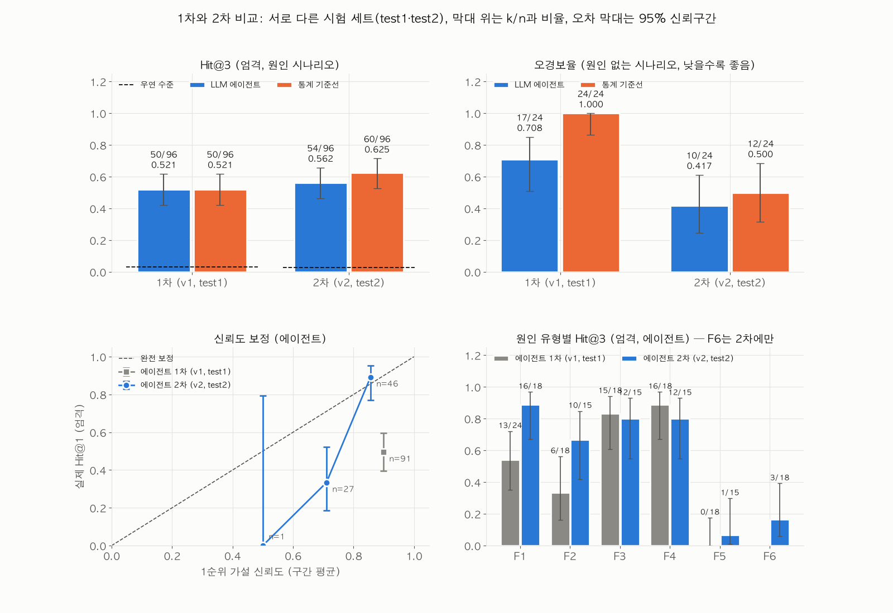

# excursion-tracer

결과 페이지: https://excursion-tracer.vercel.app (한 화면 요약, README, 그림, 대표 시나리오 추적 기록, 실패 사례 분석)

반도체 팹에서 수율 이상(excursion) 알림이 떴을 때, 원인이 된 설비·챔버·레시피·시간대를 역추적하는 LLM 에이전트와 그 평가 환경이다. 원인을 심어 둔 가상 팹 시나리오에서 LLM 에이전트와 통계만 쓰는 기준선을 같은 조건으로 채점한다. 1차 평가에서 드러난 실패를 실행 기록으로 추적해 2차 버전을 만들었고, 2차는 새로 만든 시험 세트로만 평가했다.

## 푸는 문제

수율이 떨어지면 엔지니어는 불량 웨이퍼들이 공통으로 거친 설비·챔버·레시피·시간대를 찾는다(공통성 분석). 이 분석이 어려운 이유는 다음과 같다.

- **교란**: 로트가 특정 설비 경로로 몰려 다니면, 원인이 아닌 설비도 같이 의심받는다.
- **다중 비교**: 단계 수십 개 × 설비·챔버 수백 개를 검정하면 우연한 차이도 유의하게 나온다.
- **시간과 제품 구성**: 문제가 중간에 시작되거나, 수율이 낮은 제품의 비중이 늘기만 해도 평균이 떨어진다.
- **설비 공통이 아닌 원인**: 레시피 변경처럼 한 단계의 모든 설비에 똑같이 걸리는 원인은 설비끼리 비교해서는 보이지 않는다.

이 저장소가 답하려는 질문은 세 가지다. 에이전트가 원인을 얼마나 정확히 짚는가? 원인이 설비에 없을 때 원인을 지어내지 않는가? 통계만 쓴 방식보다 어디서 낫고 어디서 못한가?

## 구조


| 구성 | 위치 | 하는 일 |
|---|---|---|
| 가상 팹 시나리오 생성기 | `src/excursion_tracer/sim/` | 40단계 공정, 제품 2종, 로트 흐름, PM·레시피 변경 이벤트, 수율 모델을 seed로 만든다. 원인 유형 8가지를 심고, 알림(alarm·warning) 규칙을 통과한 시나리오만 남긴다 |
| 통계 엔진 | `src/excursion_tracer/stats/` | 제품별 층화 Mann-Whitney·Fisher 검정을 Stouffer로 합치고 전체 p값을 Benjamini-Hochberg로 보정한 공통성 스캔, 변화점(순열검정), 이벤트 전후 비교, 설비×레시피 상호작용, 교란(파이 계수·층화 비교). 2차에서 알림 전 구간의 "평소 차이"와 후보별 평소 대비 배수, 제품 보정 하락, 모든 이벤트의 전후 스캔을 더했다 |
| 통계 기준선 | `stats/baseline.py`, `stats/baseline_v2.py` | 통계 결과만으로 상위 3개 가설을 낸다. v2는 평소 대비 배수로 순위·원인 없음·신뢰도를 정하고, 이벤트 후보와 설비×레시피 가설을 낼 수 있다 |
| LLM 에이전트 | `src/excursion_tracer/agent/`, `src/excursion_tracer/llm/` | 통계 코드가 만든 근거 묶음(근거 ID 부여)을 Google Gemini API(`gemini-3.5-flash-lite`)에 보내 원인 가설·반증 방법·권고 조치를 구조화 출력(JSON 스키마)으로 받는다. v2는 1회차에 잠정 보고서와 반증 확인 1~3개를 반드시 요청하고, 코드가 확인을 실행한 뒤 2회차에 최종 보고서를 받는다. 가설 ID를 팹 구조와 대조해 정규화하고, 보고서 속 숫자가 근거에 있는지 자동으로 대조한다 |
| 평가기 | `src/excursion_tracer/eval/` | 정답 대조(엄격·느슨), Hit@1·Hit@3·MRR, 오경보율, 미탐율, 신뢰도 보정, 반복성, 반증 확인 효과, Wilson 95% 신뢰구간, 우연 수준, McNemar 쌍대 비교 |

### 원인 유형

| 코드 | 원인 | 정답 단위 | 세트 |
|---|---|---|---|
| F0a | 원인 없음 (우연한 변동으로 생긴 알림) | 없음 | 전체 |
| F0b | 원인 없음 (수율이 낮은 제품의 투입 비중 증가) | 없음 | 전체 |
| F1 | 정비(PM) 후 특정 챔버 열화 | 챔버 | 전체 |
| F2 | 특정 설비가 특정 레시피로 처리한 웨이퍼만 불량 | 설비 + 레시피 | 전체 |
| F3 | 설비 영향이 시간에 따라 선형으로 커지는 드리프트 | 설비 | 전체 |
| F4 | F1·F2·F3 중 두 개가 서로 다른 단계에 동시에 | 둘 다 | 전체 |
| F5 | 공통 레시피 단계의 레시피 변경 이후 그 단계의 모든 웨이퍼 불량 | 레시피 | test1·test2 |
| F6 | 시작 이후 12~24시간짜리 구간 2~3개에서만 특정 챔버 불량 (간헐적 이상) | 챔버 | test2 |

난이도는 효과 크기(대·중·소) × 경로 몰림 정도(`stickiness`, 교란의 세기)의 6칸으로 나누어 고르게 배분한다.

### 출제자와 풀이자의 분리

- 정답 파일 `ground_truth.json`은 평가기(`eval/`)만 읽는다. `stats/`·`agent/`·`llm/`이 정답 파일을 읽거나 정답을 다루는 모듈을 import하지 못하게 테스트로 막는다(`tests/test_isolation.py`).
- 관측 파일에는 원인을 암시하는 컬럼·값·단어가 없는지 테스트로 확인한다.
- 에이전트 프롬프트는 개발 세트(dev)로만 두 라운드 다듬어 고정한 뒤 시험 세트를 만들었다. 1차는 test1, 2차는 2차 프롬프트 고정 이후 새 seed로 만든 test2로 평가했다. 프롬프트에는 특정 원인 유형 전용 지시가 없고, 각 시험 세트에는 개발 중 없던 원인 유형(test1의 F5, test2의 F6)이 들어 있다.

## 주요 결과

아래 숫자는 `results/summary.json`에서 `scripts/make_readme_results.py`로 옮긴 것이다. 시나리오별 채점은 `results/per_scenario.csv`에 있다.

<!-- results:start -->
### 2차: 새 시험 세트 test2

test2 120개 (F0a 12, F0b 12, F1 18, F2 15, F3 15, F4 15, F5 15, F6 18). 2차 프롬프트를 고정한 뒤 새 seed로 만들었고, 개발 중 없던 원인 유형 F6를 넣었다. 비율 옆 괄호는 95% Wilson 신뢰구간이다.

| 지표 | 에이전트 v2 | 기준선 v2 | 기준선 v1 |
|---|---|---|---|
| Hit@1 (엄격) | 50/96 = 0.521 [0.422, 0.618] | 43/96 = 0.448 [0.352, 0.547] | 34/96 = 0.354 [0.266, 0.454] |
| Hit@3 (엄격) | 54/96 = 0.562 [0.463, 0.657] | 60/96 = 0.625 [0.525, 0.715] | 39/96 = 0.406 [0.313, 0.506] |
| Hit@3 (느슨) | 59/96 = 0.615 [0.515, 0.706] | 62/96 = 0.646 [0.546, 0.734] | 58/96 = 0.604 [0.504, 0.696] |
| F4 두 원인 모두 상위 3개 (엄격) | 7/15 = 0.467 [0.248, 0.699] | 5/15 = 0.333 [0.152, 0.583] | 3/15 = 0.200 [0.070, 0.452] |
| 오경보율 (원인 없는 시나리오) | 10/24 = 0.417 [0.245, 0.612] | 12/24 = 0.500 [0.314, 0.686] | 24/24 = 1.000 [0.862, 1.000] |
| 미탐율 | 22/96 = 0.229 [0.156, 0.323] | 10/96 = 0.104 [0.058, 0.181] | 0/96 = 0.000 [0.000, 0.038] |
| 시작 시각 정확도 (±1일) | 26/30 = 0.867 [0.703, 0.947] | 35/37 = 0.946 [0.823, 0.985] | 20/24 = 0.833 [0.641, 0.933] |
| 제품 구성 변화 설명 (F0b) | 6/12 = 0.500 [0.254, 0.746] | 12/12 = 1.000 [0.758, 1.000] | 0/12 = 0.000 [0.000, 0.242] |
| 형식 실패율 | 0/120 = 0.000 [0.000, 0.031] | 0/120 = 0.000 [0.000, 0.031] | 0/120 = 0.000 [0.000, 0.031] |
| 근거 없는 숫자가 있는 보고서 | 5/120 = 0.042 [0.018, 0.094] | - | - |
| MRR (엄격) | 0.538 | 0.531 | 0.375 |
| 반복성 (판정·1순위 일치) | 5/10 = 0.500 [0.237, 0.763] (3회 실행) | - | - |
| 시나리오당 LLM 요청 수 | 2.02 | 0 | 0 |
| 시나리오당 처리 시간 (초) | 19.05 | 3.87 | 0.37 |

- McNemar (Hit@3 엄격, 같은 원인 시나리오 96쌍) 기준선 v1 대 기준선 v2: 둘 다 적중 30, 기준선 v1만 9, 기준선 v2만 30, 둘 다 실패 27, p = 0.001
- McNemar (Hit@3 엄격, 같은 원인 시나리오 96쌍) 기준선 v1 대 에이전트 v2: 둘 다 적중 33, 기준선 v1만 6, 에이전트 v2만 21, 둘 다 실패 36, p = 0.006
- McNemar (Hit@3 엄격, 같은 원인 시나리오 96쌍) 기준선 v2 대 에이전트 v2: 둘 다 적중 44, 기준선 v2만 16, 에이전트 v2만 10, 둘 다 실패 26, p = 0.327
- 우연 수준 (정답과 같은 수준의 후보에서 무작위 3개): Hit@3 엄격 0.0262, 느슨 0.0859
- 반증 확인: 요청 120/120 = 1.000 [0.969, 1.000], 1순위가 바뀐 비율 9/120 = 0.075 [0.040, 0.136]; 바뀐 원인 시나리오의 Hit@3 엄격 잠정 2/9 = 0.222 [0.063, 0.547] → 최종 2/9 = 0.222 [0.063, 0.547]
- ID 검증: 정규화한 시나리오 0/120 = 0.000 [0.000, 0.031], ID 재요청 0/120 = 0.000 [0.000, 0.031], 해석 안 된 ID가 남은 보고서 0/120 = 0.000 [0.000, 0.031]
- 에이전트 v2 LLM 요청 243회, 비용 0.00달러

원인 유형별 Hit@3 (엄격) / 오경보율 (test2)

| 유형 | 내용 | 에이전트 v2 | 기준선 v2 | 기준선 v1 |
|---|---|---|---|---|
| F0a | 원인 없음 (우연) (오경보) | 4/12 = 0.333 [0.138, 0.609] | 6/12 = 0.500 [0.254, 0.746] | 12/12 = 1.000 [0.758, 1.000] |
| F0b | 원인 없음 (제품 구성 변화) (오경보) | 6/12 = 0.500 [0.254, 0.746] | 6/12 = 0.500 [0.254, 0.746] | 12/12 = 1.000 [0.758, 1.000] |
| F1 | 정비 후 챔버 열화 | 16/18 = 0.889 [0.672, 0.969] | 15/18 = 0.833 [0.608, 0.942] | 15/18 = 0.833 [0.608, 0.942] |
| F2 | 설비×레시피 조합 | 10/15 = 0.667 [0.417, 0.848] | 11/15 = 0.733 [0.480, 0.891] | 0/15 = 0.000 [0.000, 0.204] |
| F3 | 설비 드리프트 | 12/15 = 0.800 [0.548, 0.930] | 9/15 = 0.600 [0.357, 0.802] | 12/15 = 0.800 [0.548, 0.930] |
| F4 | 두 원인 동시 | 12/15 = 0.800 [0.548, 0.930] | 11/15 = 0.733 [0.480, 0.891] | 9/15 = 0.600 [0.357, 0.802] |
| F5 | 레시피 버전 변경 | 1/15 = 0.067 [0.012, 0.298] | 14/15 = 0.933 [0.702, 0.988] | 0/15 = 0.000 [0.000, 0.204] |
| F6 | 간헐적 챔버 이상 | 3/18 = 0.167 [0.058, 0.392] | 0/18 = 0.000 [0.000, 0.176] | 3/18 = 0.167 [0.058, 0.392] |

### 1차: 시험 세트 test1

test1 120개. 1차 프롬프트를 고정한 뒤 만들었다. 1차 결과를 본 뒤 F4의 적중 정의를 통일해(두 원인 중 하나 이상 적중) 두 방법 모두 다시 채점했다.

| 지표 | 에이전트 v1 | 기준선 v1 |
|---|---|---|
| Hit@1 (엄격) | 45/96 = 0.469 [0.372, 0.568] | 45/96 = 0.469 [0.372, 0.568] |
| Hit@3 (엄격) | 50/96 = 0.521 [0.422, 0.618] | 50/96 = 0.521 [0.422, 0.618] |
| Hit@3 (느슨) | 57/96 = 0.594 [0.494, 0.687] | 71/96 = 0.740 [0.644, 0.817] |
| F4 두 원인 모두 상위 3개 (엄격) | 5/18 = 0.278 [0.125, 0.509] | 4/18 = 0.222 [0.090, 0.452] |
| 오경보율 (원인 없는 시나리오) | 17/24 = 0.708 [0.508, 0.851] | 24/24 = 1.000 [0.862, 1.000] |
| 미탐율 | 5/96 = 0.052 [0.022, 0.116] | 0/96 = 0.000 [0.000, 0.038] |
| 시작 시각 정확도 (±1일) | 19/21 = 0.905 [0.711, 0.973] | 26/28 = 0.929 [0.774, 0.980] |
| 제품 구성 변화 설명 (F0b) | 10/12 = 0.833 [0.552, 0.953] | 0/12 = 0.000 [0.000, 0.242] |
| 형식 실패율 | 0/120 = 0.000 [0.000, 0.031] | 0/120 = 0.000 [0.000, 0.031] |
| 근거 없는 숫자가 있는 보고서 | 5/120 = 0.042 [0.018, 0.094] | - |
| MRR (엄격) | 0.493 | 0.491 |
| 반복성 (판정·1순위 일치) | 14/20 = 0.700 [0.481, 0.855] (3회 실행) | - |
| 시나리오당 LLM 요청 수 | 1.13 | 0 |
| 시나리오당 처리 시간 (초) | 8.98 | 0.35 |

- McNemar (Hit@3 엄격, 같은 원인 시나리오 96쌍) 기준선 v1 대 에이전트 v1: 둘 다 적중 40, 기준선 v1만 10, 에이전트 v1만 10, 둘 다 실패 36, p = 1.000

원인 유형별 Hit@3 (엄격) / 오경보율 (test1)

| 유형 | 내용 | 에이전트 v1 | 기준선 v1 |
|---|---|---|---|
| F0a | 원인 없음 (우연) (오경보) | 11/12 = 0.917 [0.646, 0.985] | 12/12 = 1.000 [0.758, 1.000] |
| F0b | 원인 없음 (제품 구성 변화) (오경보) | 6/12 = 0.500 [0.254, 0.746] | 12/12 = 1.000 [0.758, 1.000] |
| F1 | 정비 후 챔버 열화 | 13/24 = 0.542 [0.351, 0.721] | 21/24 = 0.875 [0.690, 0.957] |
| F2 | 설비×레시피 조합 | 6/18 = 0.333 [0.163, 0.563] | 0/18 = 0.000 [0.000, 0.176] |
| F3 | 설비 드리프트 | 15/18 = 0.833 [0.608, 0.942] | 15/18 = 0.833 [0.608, 0.942] |
| F4 | 두 원인 동시 | 16/18 = 0.889 [0.672, 0.969] | 14/18 = 0.778 [0.548, 0.910] |
| F5 | 레시피 버전 변경 | 0/18 = 0.000 [0.000, 0.176] | 0/18 = 0.000 [0.000, 0.176] |

### 프롬프트 개선 라운드 (dev 30개, 시험 세트와 별도)

| 라운드 | Hit@3 (엄격) | 오경보율 |
|---|---|---|
| 에이전트 v1 1라운드 | 17/24 = 0.708 [0.508, 0.851] | 6/6 = 1.000 [0.610, 1.000] |
| 에이전트 v1 2라운드 (고정) | 17/24 = 0.708 [0.508, 0.851] | 5/6 = 0.833 [0.436, 0.970] |
| 에이전트 v2 1라운드 | 19/24 = 0.792 [0.595, 0.908] | 4/6 = 0.667 [0.300, 0.903] |
| 에이전트 v2 2라운드 (고정) | 19/24 = 0.792 [0.595, 0.908] | 2/6 = 0.333 [0.097, 0.700] |
<!-- results:end -->



| | |
|---|---|
|  |  |
|  |  |
|  |  |

- 위 그림은 2차(test2) 기준이다. 1차(test1) 그림은 `results/figures/v1/`에 있다.
- 대표 시나리오 추적 기록(알림 → 근거 → 잠정 가설 → 확인 → 최종 보고서 → 정답 공개): `results/traces/` (1차는 `results/traces/v1/`)
- 실패 사례 분석과 1차 진단의 2차 결과: `results/failure_analysis_v2.md` (1차는 `results/failure_analysis.md`, 원자료 `results/diagnosis_v1_v2.json`, `results/v1_id_check.*`)

## 재현

Python 3.11 이상.

```bash
python3 -m venv .venv && source .venv/bin/activate
pip install -e ".[dev]"
cp .env.example .env          # GEMINI_API_KEY 를 적는다 (Google AI Studio에서 발급)
pytest                        # 생성기·통계·평가기·에이전트 테스트 (API 호출 없음)
```

LLM 요청 한도(`llm.rpm_limit`, `llm.rpd_limit`)는 `config/default.yaml`에 사용하는 키의 값으로 적는다. 호출 전에 하루 한도의 90%에 닿으면 멈추고 다음 초기화 시각을 알려 준다. 요청 한도 오류와 서버 일시 오류는 간격을 늘려 가며 다시 시도하고, 이미 끝난 시나리오는 건너뛰므로 같은 명령으로 이어서 실행할 수 있다.

```bash
# dev 세트: 생성 → 기준선 → 에이전트 → 평가
python scripts/gen_scenarios.py --set dev
python scripts/run_baseline.py --set dev                  # 기준선 v1
python scripts/run_baseline.py --set dev --version v2     # 기준선 v2
python scripts/run_agent.py --estimate                    # 지금 한도로 돌릴 수 있는 양
python scripts/run_agent.py --set dev --version v2
python scripts/evaluate.py --set dev --method baseline=runs/baseline/dev \
    --method baseline_v2=runs/baseline_v2/dev --method agent_v2=runs/<run_id>

# 2차 시험 세트 test2 (에이전트 v2 프롬프트를 고정한 뒤)
python scripts/gen_scenarios.py --set test2 --skip-freeze-check
python scripts/run_baseline.py --set test2
python scripts/run_baseline.py --set test2 --version v2
python scripts/run_agent.py --set test2 --version v2
python scripts/evaluate.py --set test2 --method baseline=runs/baseline/test2 \
    --method baseline_v2=runs/baseline_v2/test2 --method agent_v2=runs/<run_id>
python scripts/run_extra.py showcase --set test2 --version v2     # 대표 시나리오 3개를 한국어로 다시 실행
python scripts/run_extra.py repeat --set test2 --version v2 --sample-n 10
python scripts/evaluate.py --set test2 --method baseline=runs/baseline/test2 \
    --method baseline_v2=runs/baseline_v2/test2 --method agent_v2=runs/<run_id> \
    --repeat agent_v2=runs/<run_id>,runs/<run_id>-rep1,runs/<run_id>-rep2
python scripts/failure_cases.py --set test2 --method agent_v2 --run runs/<run_id> --out results/failure_analysis_v2.md
python scripts/diagnosis_v1_v2.py --run1 runs/<v1 run_id> --run2 runs/<run_id>
python scripts/make_figures.py --set test2
python scripts/make_readme_results.py
```

1차(에이전트 v1, test1)는 같은 명령에서 `--set test`, `--version v1`로 재현한다. `<run_id>`는 `날짜-모델-(v2-)프롬프트해시8자리`이고 `run_agent.py`가 출력한다. 시나리오 생성, 통계 기준선, 평가, 그림은 모두 로컬 계산이다. seed가 같으면 같은 시나리오 파일이 나오지만(meta.json의 생성 시각만 다르다), LLM 응답은 temperature 0에서도 실행마다 다를 수 있다(반복성 지표 참고).

## 1차에서 발견해 2차에서 고친 것

1차 실행 기록을 추적해 찾은 원인과 2차에서 바꾼 것이다. 각 항목의 1차·2차 숫자는 `results/failure_analysis_v2.md`의 진단 표에 있다.

- **줄여 쓴 ID가 오답 처리됐다.** 에이전트가 `C2`처럼 단계 접두어를 뺀 ID를 써 맞힌 답이 오답이 됐다. 2차는 가설 ID를 팹 구조와 대조해 한 가지로만 해석되면 전체 ID로 바꾸고, 해석이 안 되면 목록을 붙여 한 번 다시 요청한다. 프롬프트에도 ID를 그대로 복사하라는 규칙을 넣었다.
- **F4의 Hit@1과 Hit@3 정의가 달랐다.** 두 원인 중 하나 이상 적중으로 통일하고, 두 원인 모두 적중은 보조 지표로 따로 둔다. 1차 결과도 두 방법 모두 새 정의로 다시 채점했다.
- **평소에 설비끼리 나는 차이를 몰라 작은 차이도 원인으로 봤고, 모든 판단에 높은 신뢰도를 붙였다.** 알림 전 구간에서 같은 스캔을 돌려 "평소 차이"를 재고, 후보마다 평소 대비 배수를 근거에 넣었다. 기준선 v2와 에이전트 v2 프롬프트에 같은 1.5배 기준을 둔다.
- **추가 확인을 한 번도 요청하지 않았다.** 2차는 1순위 가설을 반증할 확인을 1~3개 반드시 요청하는 두 단계 조사로 바꿨다.
- **통계 기준선은 레시피·설비×레시피 가설을 낼 수 없었고, 레시피 변경은 근거에 잘 드러나지 않았다.** 모든 이벤트의 전후 스캔과 제품별 효과로 설비×레시피를 가르는 판정을 기준선 v2에 넣고, 이벤트 후보를 근거 묶음에도 넣었다.
- **근거 묶음의 제품 구성 항목이 좁았다.** 제품별 알림 전후 변화와 제품 비중을 고정했을 때의 변화를 넣었다.
- **출력 길이 한도에서 끊긴 응답이 있었다.** 1회차·2회차의 출력 한도를 늘렸다.

## 한계

- **가상 데이터다.** 실제 팹 데이터가 아니고, 공정 시간은 실제보다 크게 압축했다(투입부터 측정까지 약 2~3일). 실제 라인에 적용하려면 원인이 확정된 과거 이상 사례로 같은 평가를 다시 해야 한다.
- **설계자가 문제를 안다.** 시험 세트마다 개발 중 없던 원인 유형(F5, F6)을 넣었지만, 이 유형을 설계한 사람이 에이전트도 만들었다. 프롬프트에는 일반 원칙만 넣었다.
- **2차 개선은 1차 시험 세트의 실패를 보고 설계했다.** 그래서 2차 평가는 2차 프롬프트 고정 이후 새 seed로 만든 test2로만 했고, 1차와 2차 수치는 서로 다른 세트의 결과다.
- **에이전트의 추가 확인 요청 중 일부가 필드 누락으로 오류 결과를 받았다.** 확인 결과는 오류 메시지로 돌아가 그 확인은 판단에 쓰이지 못했다. 고정 이후라 2차 결과는 이 상태로 얻었다.
- **단계 전체에 걸린 원인과 간헐적 원인은 에이전트가 여전히 잘 짚지 못했다.** 원인 유형별 표의 F5·F6 행이 그 결과다.
- **생성기 점검 일부가 시험 세트에서 기준을 넘었다.** 원인 없는 시나리오의 설비별 수율 차이 점검과, 심은 효과 크기가 설정값의 ±30% 안에 드는지 보는 점검에서 일부 시나리오가 기준을 넘었다. 시험 세트는 생성된 그대로 평가했다(`tests/test_sim.py`, `tests/test_sim_decoy.py`).
- **웨이퍼를 독립 표본으로 검정한다.** 같은 로트의 웨이퍼는 로트 효과를 공유하므로, 공통성 스캔의 p·q값은 로트 단위 상관을 반영하지 않는다. 2차는 이를 평소 대비 배수로 보완했지만 검정 자체는 바꾸지 않았다.
- **반복성 표본은 요청 한도 때문에 줄였다.** 2차 반복성은 원인 유형별로 층화한 10개 시나리오에서 쟀다.
- **외부 무료 API를 쓴다.** 무료 등급에 보낸 내용은 제공사가 제품 개선에 쓸 수 있다. 이 저장소는 가상 데이터만 보낸다. 실제 데이터에 쓰려면 `llm/base.py`의 인터페이스에 맞춘 사내 모델 어댑터로 바꿔야 한다.
- **판단은 사람이 한다.** 에이전트는 근거가 붙은 원인 후보, 반증 방법, 권고 조치를 낼 뿐이고, 공통성 분석은 연관이지 인과가 아니다.

## 디렉터리

```text
config/default.yaml     설정 (팹 구조, 수율 모델, 원인 효과 크기, 알림 규칙, 세트 구성, LLM 한도, v2 기준값)
src/excursion_tracer/   sim · stats · llm · agent · eval · viz
scripts/                생성·실행·평가·그림 명령
tests/                  테스트
results/                summary.json, per_scenario.csv, 그림, 추적 기록, 실패 사례 분석, 진단 표
site/                   결과 페이지
data/ runs/ logs/       생성 데이터, 실행 기록, 사용량 기록 (저장소에 올리지 않음)
```
