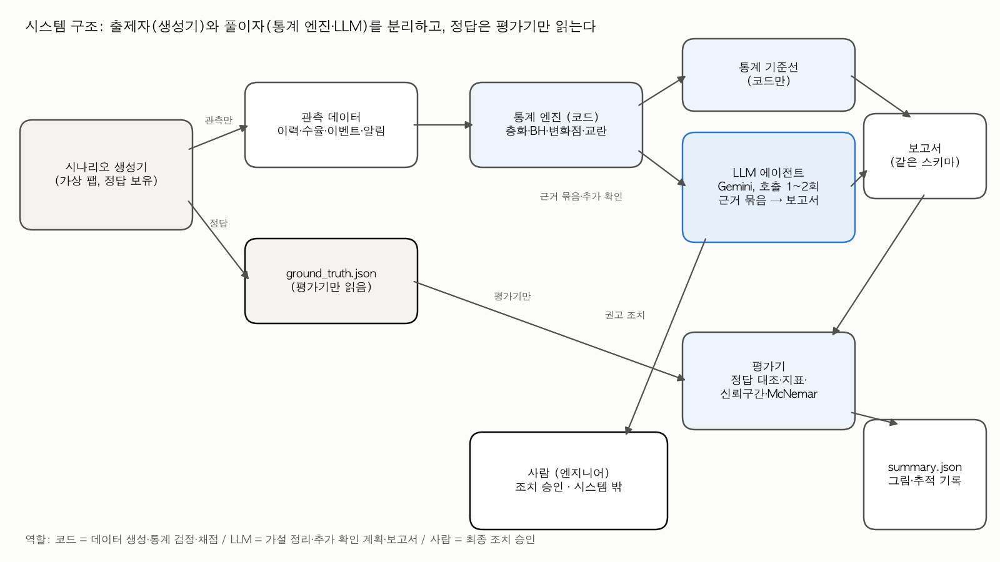
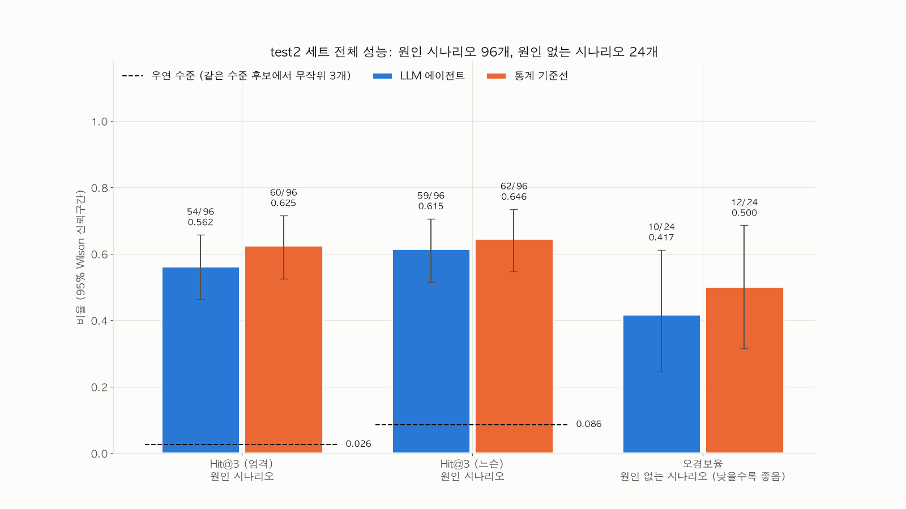
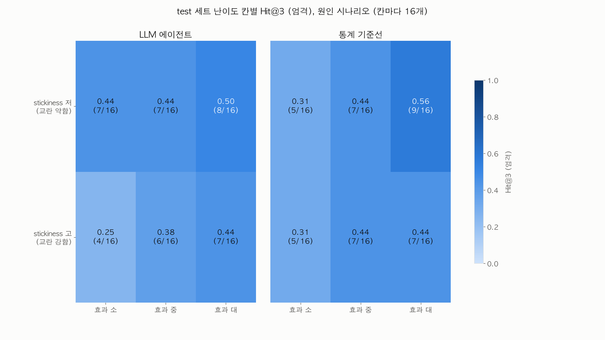
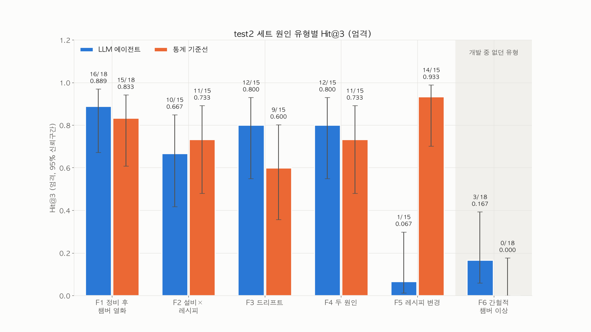
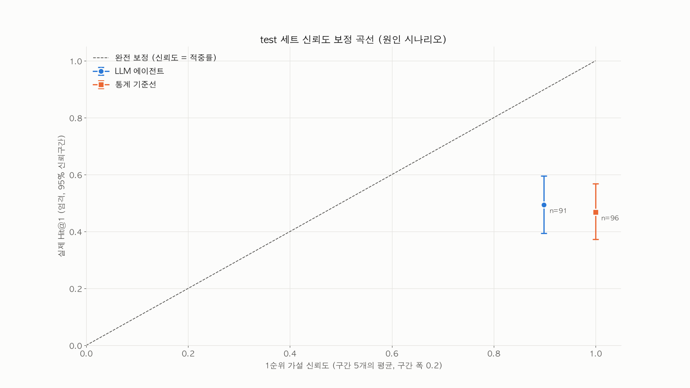
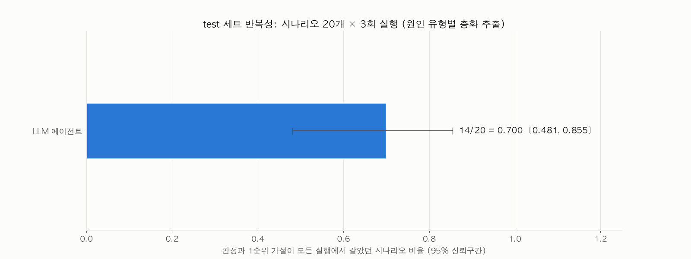
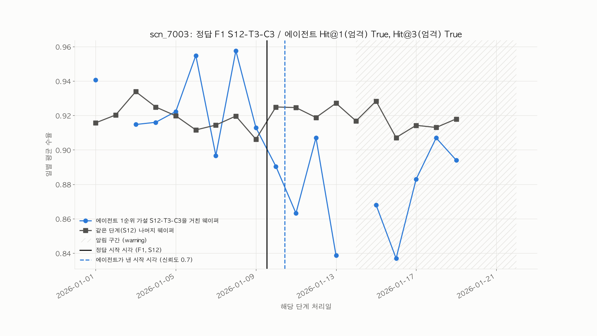

# excursion-tracer

반도체 팹에서 수율 이상(excursion) 알림이 떴을 때, 원인이 된 설비·챔버·레시피·시간대를 역추적하는 LLM 에이전트와 그 평가 환경이다. 원인을 심어 둔 가상 팹 시나리오에서 LLM 에이전트와 통계만 쓰는 기준선을 같은 조건으로 채점한다.

## 푸는 문제

수율이 떨어지면 엔지니어는 불량 웨이퍼들이 공통으로 거친 설비·챔버·레시피·시간대를 찾는다(공통성 분석). 이 분석이 어려운 이유는 다음과 같다.

- **교란**: 로트가 특정 설비 경로로 몰려 다니면, 원인이 아닌 설비도 같이 의심받는다.
- **다중 비교**: 단계 수십 개 × 설비·챔버 수백 개를 검정하면 우연한 차이도 유의하게 나온다.
- **시간과 제품 구성**: 문제가 중간에 시작되거나, 수율이 낮은 제품의 비중이 늘기만 해도 평균이 떨어진다.
- **설비 공통이 아닌 원인**: 레시피 변경처럼 한 단계의 모든 설비에 똑같이 걸리는 원인은 설비끼리 비교해서는 보이지 않는다.

이 저장소가 답하려는 질문은 세 가지다. 에이전트가 원인을 얼마나 정확히 짚는가? 원인이 설비에 없을 때 원인을 지어내지 않는가? 통계만 쓴 방식보다 어디서 낫고 어디서 못한가?

## 구조



| 구성 | 위치 | 하는 일 |
|---|---|---|
| 가상 팹 시나리오 생성기 | `src/excursion_tracer/sim/` | 40단계 공정, 제품 2종, 로트 흐름, PM·레시피 변경 이벤트, 수율 모델을 seed로 만든다. 원인 유형 7가지를 심고, 알림(alarm·warning) 규칙을 통과한 시나리오만 남긴다 |
| 통계 엔진과 기준선 | `src/excursion_tracer/stats/` | 제품별 층화 Mann-Whitney·Fisher 검정을 Stouffer로 합치고, 전체 p값을 Benjamini-Hochberg로 보정한 공통성 스캔. 변화점(순열검정), 이벤트 전후 비교, 설비×레시피 상호작용, 교란(파이 계수·층화 비교). 기준선은 이 결과만으로 상위 3개 가설을 낸다 |
| LLM 에이전트 | `src/excursion_tracer/agent/`, `src/excursion_tracer/llm/` | 통계 코드가 만든 근거 묶음(6,000자 이내, 근거 ID 부여)을 Google Gemini API(`gemini-3.5-flash-lite`)에 보내 원인 가설·반증 방법·권고 조치를 구조화 출력(JSON 스키마)으로 받는다. 필요하면 추가 확인을 최대 3개까지 한 번 요청할 수 있어, 시나리오당 호출은 1~2회다. 보고서 속 숫자가 근거에 있는지 자동으로 대조한다 |
| 평가기 | `src/excursion_tracer/eval/` | 정답 대조(엄격·느슨), Hit@1·Hit@3·MRR, 오경보율, 미탐율, 신뢰도 보정, 반복성, Wilson 95% 신뢰구간, 우연 수준, McNemar 쌍대 비교 |

### 원인 유형

| 코드 | 원인 | 정답 단위 |
|---|---|---|
| F0a | 원인 없음 (우연한 변동으로 생긴 알림) | 없음 |
| F0b | 원인 없음 (수율이 낮은 제품의 투입 비중 증가) | 없음 |
| F1 | 정비(PM) 후 특정 챔버 열화 | 챔버 |
| F2 | 특정 설비가 특정 레시피로 처리한 웨이퍼만 불량 | 설비 + 레시피 |
| F3 | 설비 영향이 시간에 따라 선형으로 커지는 드리프트 | 설비 |
| F4 | F1·F2·F3 중 두 개가 서로 다른 단계에 동시에 | 둘 다 |
| F5 | 공통 레시피 단계의 레시피 변경 이후 그 단계의 모든 웨이퍼 불량 | 레시피 |

난이도는 효과 크기(대·중·소) × 경로 몰림 정도(`stickiness`, 교란의 세기)의 6칸으로 나누어 고르게 배분한다. F5는 test 세트에만 넣었다.

### 출제자와 풀이자의 분리

- 정답 파일 `ground_truth.json`은 평가기(`eval/`)만 읽는다. `stats/`·`agent/`·`llm/`이 정답 파일을 읽거나 정답을 다루는 모듈을 import하지 못하게 테스트로 막는다(`tests/test_isolation.py`).
- 관측 파일에는 원인을 암시하는 컬럼·값·단어가 없는지 테스트로 확인한다.
- 에이전트 프롬프트는 dev 세트로만 다듬어 고정한 뒤 test 세트를 만들었다. 프롬프트에는 특정 원인 유형 전용 지시가 없다.

## 주요 결과

아래 숫자는 `results/summary.json`에서 `scripts/make_readme_results.py`로 옮긴 것이다. 시나리오별 채점은 `results/per_scenario.csv`에 있다.

<!-- results:start -->
test 세트 120개 (F0a 12, F0b 12, F1 24, F2 18, F3 18, F4 18, F5 18). 원인 시나리오 96개, 원인 없는 시나리오 24개. 비율 옆 괄호는 95% Wilson 신뢰구간이다.

| 지표 | LLM 에이전트 | 통계 기준선 |
|---|---|---|
| Hit@1 (엄격) | 45/96 = 0.469 [0.372, 0.568] | 45/96 = 0.469 [0.372, 0.568] |
| Hit@3 (엄격) | 39/96 = 0.406 [0.313, 0.506] | 40/96 = 0.417 [0.323, 0.517] |
| Hit@1 (느슨) | 54/96 = 0.562 [0.463, 0.657] | 63/96 = 0.656 [0.557, 0.744] |
| Hit@3 (느슨) | 57/96 = 0.594 [0.494, 0.687] | 71/96 = 0.740 [0.644, 0.817] |
| 오경보율 (원인 없는 시나리오) | 17/24 = 0.708 [0.508, 0.851] | 24/24 = 1.000 [0.862, 1.000] |
| 미탐율 | 5/96 = 0.052 [0.022, 0.116] | 0/96 = 0.000 [0.000, 0.038] |
| 시작 시각 정확도 (±1일) | 19/21 = 0.905 [0.711, 0.973] | 26/28 = 0.929 [0.774, 0.980] |
| 제품 구성 변화 설명 (F0b) | 10/12 = 0.833 [0.552, 0.953] | 0/12 = 0.000 [0.000, 0.242] |
| 형식 실패율 | 0/120 = 0.000 [0.000, 0.031] | 0/120 = 0.000 [0.000, 0.031] |
| MRR (엄격) | 0.380 | 0.384 |
| 근거 없는 숫자가 있는 보고서 비율 | 5/120 = 0.042 [0.018, 0.094] | - |
| 반복성 (20개 × 3회, 판정·1순위 일치) | 14/20 = 0.700 [0.481, 0.855] | - |
| 추가 확인을 요청한 시나리오 비율 | 0/120 = 0.000 [0.000, 0.031] | - |
| 시나리오당 LLM 요청 수 (평균) | 1.13 | 0 |
| 시나리오당 처리 시간 (평균, 초) | 8.98 | 0.35 |

- 우연 수준 (정답과 같은 수준의 후보에서 무작위 3개): Hit@3 엄격 0.0257, 느슨 0.0871
- McNemar (Hit@3 엄격, 같은 원인 시나리오 96쌍): 둘 다 적중 31, 기준선만 9, 에이전트만 8, 둘 다 실패 48, p = 1.000
- 알림이 없어 다시 만든 시나리오 수: 6

원인 유형별 Hit@3 (엄격) / 오경보율

| 유형 | 내용 | LLM 에이전트 | 통계 기준선 |
|---|---|---|---|
| F0a | 원인 없음 (우연) (오경보) | 11/12 = 0.917 [0.646, 0.985] | 12/12 = 1.000 [0.758, 1.000] |
| F0b | 원인 없음 (제품 구성 변화) (오경보) | 6/12 = 0.500 [0.254, 0.746] | 12/12 = 1.000 [0.758, 1.000] |
| F1 | 정비 후 챔버 열화 | 13/24 = 0.542 [0.351, 0.721] | 21/24 = 0.875 [0.690, 0.957] |
| F2 | 설비×레시피 조합 | 6/18 = 0.333 [0.163, 0.563] | 0/18 = 0.000 [0.000, 0.176] |
| F3 | 설비 드리프트 | 15/18 = 0.833 [0.608, 0.942] | 15/18 = 0.833 [0.608, 0.942] |
| F4 | 두 원인 동시 | 5/18 = 0.278 [0.125, 0.509] | 4/18 = 0.222 [0.090, 0.452] |
| F5 | 레시피 버전 변경 (test 전용) | 0/18 = 0.000 [0.000, 0.176] | 0/18 = 0.000 [0.000, 0.176] |

프롬프트는 dev 세트(30개)로만 두 라운드 다듬은 뒤 고정했고, 그 뒤에 test 세트를 만들었다.

| dev 라운드 | Hit@3 (엄격) | 오경보율 |
|---|---|---|
| 1 | 13/24 = 0.542 [0.351, 0.721] | 6/6 = 1.000 [0.610, 1.000] |
| 2 (고정) | 13/24 = 0.542 [0.351, 0.721] | 5/6 = 0.833 [0.436, 0.970] |
<!-- results:end -->

| | |
|---|---|
|  |  |
|  |  |
|  |  |

- 대표 시나리오 추적 기록(도구 호출 순서, 각 결과의 핵심 숫자, 최종 보고서, 정답 공개): `results/traces/`
- 실패 사례 5건 분석(원인 유형이 겹치지 않게 선정): `results/failure_analysis.md`

## 재현

Python 3.11 이상.

```bash
python3 -m venv .venv && source .venv/bin/activate
pip install -e ".[dev]"
cp .env.example .env          # GEMINI_API_KEY 를 적는다 (Google AI Studio에서 발급)
pytest                        # 생성기·통계·평가기·에이전트 테스트 (API 호출 없음)
```

LLM 요청 한도(`llm.rpm_limit`, `llm.rpd_limit`)는 `config/default.yaml`에 사용하는 키의 값으로 적는다. 호출 전에 하루 한도의 90%에 닿으면 멈추고 다음 초기화 시각을 알려 준다. 이미 끝난 시나리오는 건너뛰므로 한도가 다시 채워진 뒤 같은 명령으로 이어서 실행할 수 있다.

```bash
# 1. dev 세트: 생성 → 기준선 → 에이전트 → 평가
python scripts/gen_scenarios.py --set dev
python scripts/calibrate_alerts.py                 # 난이도 칸별 알림 폐기율
python scripts/make_sanity_figures.py --set dev    # 생성기 점검 그림
python scripts/run_baseline.py --set dev
python scripts/run_agent.py --estimate             # 지금 한도로 돌릴 수 있는 시나리오 수
python scripts/run_agent.py --set dev
python scripts/evaluate.py --set dev --method baseline=runs/baseline/dev --method agent=runs/<run_id>

# 2. test 세트 (프롬프트를 고정한 뒤)
python scripts/gen_scenarios.py --set test --skip-freeze-check
python scripts/run_baseline.py --set test
python scripts/run_agent.py --set test
python scripts/run_extra.py repeat --set test      # 반복성: 층화 추출 20개 × 추가 2회
python scripts/evaluate.py --set test --method baseline=runs/baseline/test --method agent=runs/<run_id> \
    --repeat agent=runs/<run_id>,runs/<run_id>-rep1,runs/<run_id>-rep2
python scripts/run_extra.py showcase --set test    # 대표 시나리오 3개를 한국어 보고서로 다시 실행
python scripts/failure_cases.py --set test --run runs/<run_id>
python scripts/make_figures.py --set test
python scripts/make_readme_results.py
```

`<run_id>`는 `날짜-모델-프롬프트해시8자리`이고 `run_agent.py`가 출력한다. 시나리오 생성, 통계 기준선, 평가, 그림은 모두 로컬 계산이다. seed가 같으면 같은 시나리오 파일이 나오지만(meta.json의 생성 시각만 다르다), LLM 응답은 temperature 0에서도 실행마다 다를 수 있다(반복성 지표 참고).

## 한계

- **가상 데이터다.** 실제 팹 데이터가 아니고, 공정 시간은 실제보다 크게 압축했다(투입부터 측정까지 약 2~3일). 실제 라인에 적용하려면 원인이 확정된 과거 이상 사례로 같은 평가를 다시 해야 한다.
- **설계자가 문제를 안다.** test 세트에만 넣은 원인 유형(F5)이 있지만, 이 유형을 설계한 사람이 에이전트도 만들었다. 프롬프트에는 일반 원칙만 넣었다.
- **생성기 점검 일부가 test 세트에서 기준을 넘었다.** 원인 없는 시나리오의 설비별 수율 차이 점검과, 심은 효과 크기가 설정값의 ±30% 안에 드는지 보는 점검에서 일부 시나리오가 기준을 넘었다. test 세트는 생성된 그대로 평가했다(`tests/test_sim.py`, `tests/test_sim_decoy.py`).
- **근거 묶음의 제품 구성 항목이 명세보다 좁다.** 일별 제품 비중만 담고, 제품별 수율 추이는 담지 않았다. 모든 결과는 이 상태로 얻었다.
- **추가 확인 경로는 실제 실행에서 쓰이지 않았다.** 에이전트는 1회차에서 추가 확인을 요청할 수 있지만, 결과 표의 요청 비율처럼 실제로 요청하지 않았다. 추가 확인과 2회차 호출은 가짜 클라이언트 테스트로만 검증됐다.
- **레시피 수준 원인이 근거에 잘 드러나지 않는다.** 공통성 스캔은 제품별로 층화하는데, 제품별 레시피 단계는 한 제품 안에 레시피가 하나뿐이라 레시피 비교가 성립하지 않는다. 그래서 기준선은 레시피나 설비×레시피 가설을 내지 못하고(F2 엄격 적중·F5 적중이 구조적으로 어렵다), 근거 묶음의 이벤트 항목은 상위 후보 주변만 보여 주므로 F5의 레시피 변경이 근거 묶음에 나오지 않는 경우가 많다.
- **채점은 ID를 그대로 비교한다.** 에이전트가 단계 접두어를 빼고 쓴 ID(예: `C2`)는 정답과 같은 챔버를 가리켜도 오답이다.
- **출력 길이 제한에 걸린 응답이 있다.** 일부 응답이 출력 토큰 한도에서 끊겨 스키마 검증에 실패했고, 오류를 붙여 한 번 다시 요청했다.
- **웨이퍼를 독립 표본으로 검정한다.** 같은 로트의 웨이퍼는 로트 효과를 공유하므로, 공통성 스캔의 p·q값은 로트 단위 상관을 반영하지 않는다.
- **외부 무료 API를 쓴다.** 무료 등급에 보낸 내용은 제공사가 제품 개선에 쓸 수 있다. 이 저장소는 가상 데이터만 보낸다. 실제 데이터에 쓰려면 `llm/base.py`의 인터페이스에 맞춘 사내 모델 어댑터로 바꿔야 한다.
- **판단은 사람이 한다.** 에이전트는 근거가 붙은 원인 후보, 반증 방법, 권고 조치를 낼 뿐이고, 공통성 분석은 연관이지 인과가 아니다.

## 디렉터리

```text
config/default.yaml     설정 (팹 구조, 수율 모델, 원인 효과 크기, 알림 규칙, 세트 구성, LLM 한도)
src/excursion_tracer/   sim · stats · llm · agent · eval · viz
scripts/                생성·실행·평가·그림 명령
tests/                  테스트
results/                summary.json, per_scenario.csv, 그림, 추적 기록, 실패 사례 분석
data/ runs/ logs/       생성 데이터, 실행 기록, 사용량 기록 (저장소에 올리지 않음)
```
